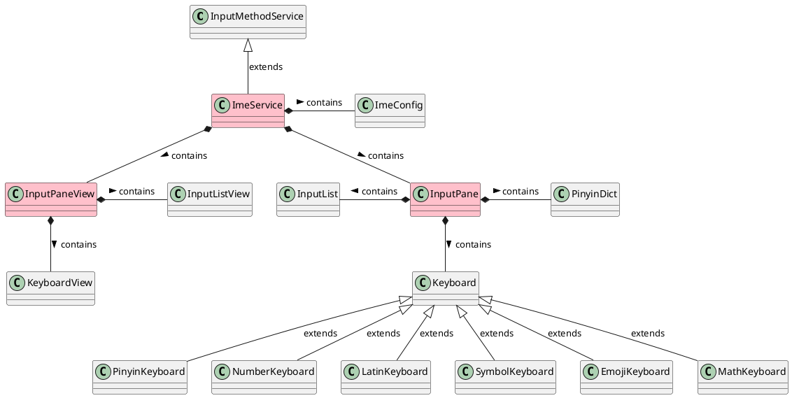
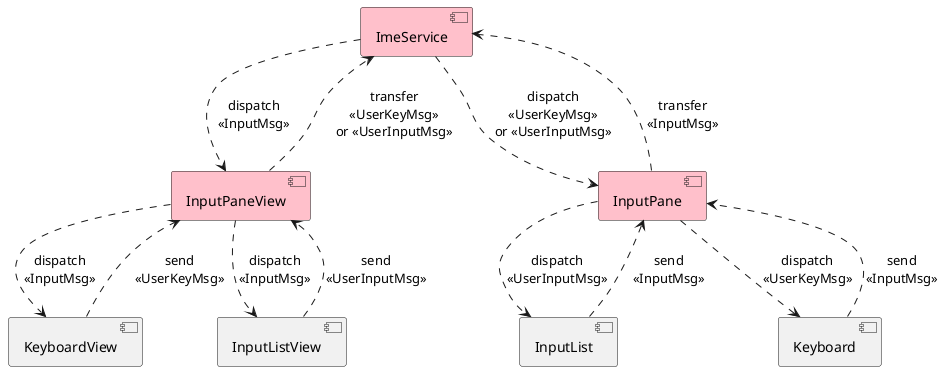

筷字输入法 Android 客户端
===================================

**注意**：本仓库仅作为筷字输入法 Android 客户端的源码仓库，
若有缺陷反馈和改进意见，请移步至
[crazydan-studio/kuaizi-ime](https://github.com/crazydan-studio/kuaizi-ime/issues)
创建 Issue。

## 项目构建

> 若需要自己生成字词典数据库，则需要从项目
> [kuaizi-ime](https://github.com/crazydan-studio/kuaizi-ime?tab=readme-ov-file#%E9%A1%B9%E7%9B%AE%E5%85%8B%E9%9A%86)
> 的子模块 `android` 克隆本项目：`git submodule update --init android`。

### 字/词典

客户端默认自带的[字典库](./app/src/main/res/raw/pinyin_word_dict.db)和[词典库](./app/src/main/res/raw/pinyin_phrase_dict.db)由工具
[kuaizi-ime/tools/pinyin-dict](https://github.com/crazydan-studio/kuaizi-ime/blob/master/tools/pinyin-dict/README.md)
生成，请参考该工具的使用说明构建客户端专用的字词典数据库。

> 注：字典数据来自于[汉典网](https://www.zdic.net)，词典数据来自于[古文之家](https://www.cngwzj.com)。

### 发布包

可直接在本项目的根目录下执行 `bash ./pack-release.sh` 以构建发布包。

> 最终的发布包可在项目根目录下的 `app/build/outputs/apk/release/` 中找到。

而在构建打包前，需要调整构建脚本中变量 `JAVA_HOME` 的值，默认为
`/usr/lib/jvm/java-17-openjdk`。

然后，在本项目的根目录下准备 APK 证书的配置文件 `./keystore/release.properties`：

```bash
cat > keystore/release.properties <<EOF
storeFile = /path/to/android-release-key.jks
storePassword = store-pass
keyPassword = key-pass
keyAlias = android-key-alias
EOF
```

> 在[《参考资料》](#参考资料)章节可阅读签名证书的生成相关的资料。

## 架构

### 核心类


<details><summary>PlantUML 代码</summary>



</details>

设计要点：

- 模型与视图分离，二者不做直接关联，模型的变更通过消息（`InputMsg`）机制触发相关视图的更新
- 将输入面板 `InputPaneView` 分为 `InputListView`（输入列表）和 `KeyboardView`（键盘）上下两部分，
  前者显示输入内容，并做候选字调整，后者则显示输入按键，并与用户做按键交互
- 与以上视图相对应的逻辑模型则分别为 `InputPane`、`InputList` 和 `Keyboard`，
  其负责对输入过程中的状态变更进行处理，实现完整的输入逻辑

### 消息流转


<details><summary>PlantUML 代码</summary>



</details>

设计要点：

- 消息始终保持单向流动，模型层或视图层发送的消息均由上一层进行转发，
  再由最顶层（`ImeService`）将消息向下分别派发至视图层或模型层。
  模型层与视图层之间不直接传递消息，从而确保二者的独立性
- 模型层中的 `Keyboard` 和 `InputList` 均触发 `InputMsg`（输入消息），
  再由相应的视图根据消息携带的数据 `InputMsgData` 做视图更新
- 视图层中的 `KeyboardView` 将触发 `UserKeyMsg`（用户操作按键的消息），
  其最终由模型层中的 `Keyboard` 处理，而 `InputListView` 则触发
  `UserInputMsg`（用户操作输入的消息），并由 `InputList` 进行处理

## 参考资料

- [APK 签名打包](https://developer.android.com/studio/publish/app-signing?hl=zh-cn)
- [深入探索 Android 包体积优化](https://juejin.cn/post/6844904103131234311)
- [VasDolly](https://github.com/Tencent/VasDolly): 是一种快速多渠道打包工具，同时支持基于 V1 签名和 V2、V3 签名进行多渠道打包
- [APK 构建配置](https://developer.android.com/build/gradle-tips): 使用 VasDolly 做多渠道打包，仅需由其注入渠道信息
  - [动态赋值](https://developer.android.com/build/gradle-tips#simplify-app-development)
  - [签名](https://developer.android.com/build/gradle-tips#remove-private-signing-information-from-your-project)
  - [为不同构建类型添加不同资源配置](https://stackoverflow.com/questions/24785270/how-to-change-app-name-per-gradle-build-type#answer-24786371)
- [Android 自定义 View 篇之（三）Canvas 绘制文字](https://www.cnblogs.com/andy-songwei/p/10968358.html):
  涉及详细的文字尺寸、基线等计算方式的说明
- [HMM 和 Viterbi 算法](https://lesley0416.github.io/2019/03/01/HMM_IM/)
- [维特比算法](https://zh.wikipedia.org/wiki/%E7%BB%B4%E7%89%B9%E6%AF%94%E7%AE%97%E6%B3%95)
- [wmhst7/THU_AI_Course_Pinyin](https://github.com/wmhst7/THU_AI_Course_Pinyin)
- [基于 Bigram+HMM 的拼音汉字转换](https://github.com/iseesaw/Pinyin2ChineseChars)

## 友情赞助

**注**：赞助时请添加备注信息 `筷字输入法`。

详细的赞助清单请查看[《友情赞助清单》](https://github.com/crazydan-studio/kuaizi-ime/blob/master/docs/donate/index.md)。

| 支付宝 | 微信支付 |
| -- | -- |
|  |  |
