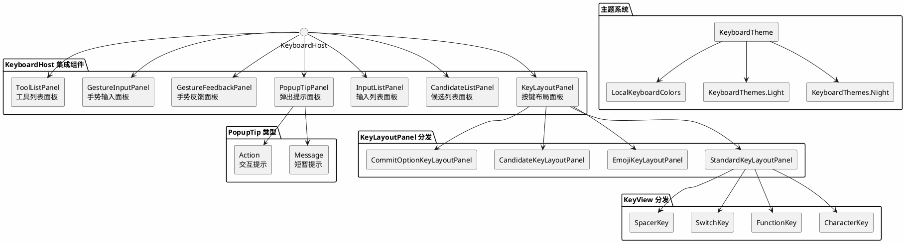

# Compose 组件

`:ime-ui` 模块的 Compose 组件层定义了输入法界面中所有可视元素的可组合函数（`Composable`）。这些组件遵循单一职责原则：展示层仅负责渲染与状态读取，交互逻辑统一由 `GestureInputPanel` 捕获后以 `InputGesture` 事件上发至 `ViewModel`。本章详细描述每个组件的签名、职责边界与内部实现要点。

---

## 1. KeyboardHost 集成组件

`KeyboardHost` 是输入法界面的顶层集成组件，负责将所有子面板组装为完整的键盘视图。它作为 `:ime-ui` 模块对外暴露的唯一入口，被 `ImeService` 在创建输入视图时调用。

```kotlin
@Composable
fun KeyboardHost(
    viewModel: KeyboardViewModel,
    modifier: Modifier = Modifier,
)
```

### 组装逻辑

`KeyboardHost` 内部按以下垂直顺序排列子组件：

1. **顶部区域** — `PopupTipPanel`，以覆盖层（`Overlay`）形式悬浮于键盘上方，用于展示 `Message` 类型和 `Action` 类型的弹出提示。
2. **候选区域** — `CandidateListPanel`，展示当前输入的候选词列表，内建 `InputActionPlayer` 的行指示器。
3. **输入列表区域** — `InputListPanel`，展示已输入的字符项、间隔项和数学表达式项。
4. **按键区域** — `KeyLayoutPanel`，根据当前 `KeyboardInputMode`（`HexGrid` 或 `RectGrid`）分发至对应的面板实现，渲染按键布局。
5. **手势反馈区域** — `GestureFeedbackPanel`，以透明覆盖层形式叠加在按键区域之上，渲染触摸轨迹、高亮和手指指示器。
6. **手势捕获区域** — `GestureInputPanel`，以全屏透明层覆盖在最上方，负责触摸事件检测与手势识别。
7. **工具区域** — `ToolListPanel`，展示工具按钮列表，内建 `InputActionPlayer` 的行指示器。

`KeyboardHost` 从 `viewModel` 读取 `KeyboardUiState`，并通过 `LocalKeyboardColors` 提供当前主题色彩上下文。所有子组件的 `modifier` 均由 `KeyboardHost` 统一管理，确保布局一致性。`KeyboardHost` 自身不处理任何触摸事件，所有交互由 `GestureInputPanel` 统一捕获后转换为 `InputGesture` 事件。

---

## 2. KeyLayoutPanel 按键布局面板

`KeyLayoutPanel` 是按键布局的分发组件，根据当前键盘的 `InputMode` 类型将渲染委托给具体的面板实现。该组件仅负责展示，不处理任何触摸事件。

```kotlin
@Composable
fun KeyLayoutPanel(
    layout: KeyLayout,
    inputMode: KeyboardInputMode,
    pressedKeys: Set<KeyId>,
    modifier: Modifier = Modifier,
)
```

### 分发逻辑

`KeyLayoutPanel` 根据 `inputMode` 的类型进行分发：

| `inputMode` 类型 | 委托面板 |
|---|---|
| `StandardInputMode` | `StandardKeyLayoutPanel` |
| `EmojiInputMode` | `EmojiKeyLayoutPanel` |
| `CandidateInputMode` | `CandidateKeyLayoutPanel` |
| `CommitOptionInputMode` | `CommitOptionKeyLayoutPanel` |

### 渲染方式

每个子面板遍历 `layout.keys` 集合，为每个 `Key` 实例创建 `KeyView` 可组合函数。`pressedKeys` 参数传递给 `KeyView` 用于渲染按下状态的视觉反馈。`KeyLayoutPanel` 负责计算按键之间的间距和整体布局的边距，确保在不同屏幕尺寸下按键排列的一致性。布局计算基于 `KeyLayout` 中定义的行列信息和每个 `Key` 的 `span` 属性，使用 Compose 的 `Layout` 可组合函数进行自定义布局测量与放置。子面板之间共享相同的布局算法，仅在按键视觉风格和数据源上存在差异。

---

## 3. KeyView 按键视图

`KeyView` 是单个按键的渲染组件，根据按键类型分发至对应的视觉实现。该组件仅负责展示，不处理触摸事件。

```kotlin
@Composable
fun KeyView(
    key: Key,
    isPressed: Boolean,
    modifier: Modifier = Modifier,
)
```

### 按键类型分发

`KeyView` 根据 `key` 的类型进行分发渲染：

| `Key` 类型 | 渲染方式 |
|---|---|
| `CharacterKey` | 显示主标签（`label`），可选显示副标签（`subLabel`），背景色根据 `isPressed` 切换 |
| `FunctionKey` | 显示图标（`icon`）或文本标签（`label`），功能键使用差异化背景色 |
| `SwitchKey` | 显示当前模式图标和标签，带有模式切换指示器 |
| `SpacerKey` | 不渲染任何内容，仅占据布局空间 |

### 视觉实现

`CharacterKey` 的渲染包含主标签居中显示、副标签在右上角以较小字号显示。按下状态通过 `KeyboardColors.keyPressedBackground` 和 `KeyboardColors.keyPressedForeground` 控制色彩变化，配合 `animateColorAsState` 实现平滑过渡动画。`FunctionKey` 使用 `KeyboardColors.functionKeyBackground` 作为默认背景，视觉上与字符键形成区分。`SwitchKey` 额外渲染一个小的模式指示点，标识当前激活的输入模式。所有按键的圆角半径由 `KeyboardColors.keyCornerShape` 统一控制，确保视觉一致性。

---

## 4. GestureInputPanel 手势输入面板

`GestureInputPanel` 是键盘界面中唯一的触摸事件捕获组件，负责检测用户手势、确定手势类型、归一化坐标并发射 `InputGesture` 事件。该组件以透明覆盖层形式叠加在所有其他面板之上。

```kotlin
@Composable
fun GestureInputPanel(
    onGesture: (InputGesture) -> Unit,
    layoutProvider: () -> KeyLayout?,
    modifier: Modifier = Modifier,
)
```

### 触摸检测

`GestureInputPanel` 使用 Compose 的 `pointerInput` 修饰符监听触摸事件。在 `detectTapGestures` 和 `detectDragGestures` 的基础上，实现了自定义手势检测器 `GestureDetector`，能够识别以下手势类型：

| 手势类型 | 触发条件 |
|---|---|
| `TapGesture` | 手指按下后在 150ms 内抬起，且移动距离小于 8dp |
| `LongPressGesture` | 手指按下后保持 400ms 未抬起且未移动 |
| `SwipeGesture` | 手指按下后移动距离超过 20dp，根据方向细分 |
| `MultiTapGesture` | 同一按键区域在 300ms 内连续点击 |

### 坐标归一化

触摸坐标在发射前进行归一化处理：将像素坐标转换为 `[0f, 1f]` 范围的相对坐标，x 轴相对于面板宽度，y 轴相对于面板高度。归一化坐标使得 `InputActionPlayer` 等下游消费者无需关心屏幕分辨率差异。

### InputGesture 发射

手势识别完成后，`GestureInputPanel` 构造 `InputGesture` 对象并通过 `onGesture` 回调发射。`InputGesture` 包含手势类型、归一化坐标、时间戳和按键标识（如能从 `layoutProvider` 解析得出）。`layoutProvider` 采用惰性调用方式，仅在需要解析按键位置时才读取当前布局状态，避免不必要的重组。

---

## 5. GestureFeedbackPanel 手势反馈面板

`GestureFeedbackPanel` 读取 `GestureFeedbackState` 状态，将归一化坐标反归一化为像素坐标，并绘制触摸轨迹、按键高亮和手指指示器。该组件以透明覆盖层形式叠加在按键区域之上，不影响下层组件的布局。

```kotlin
@Composable
fun GestureFeedbackPanel(
    state: GestureFeedbackState,
    modifier: Modifier = Modifier,
)
```

### 坐标反归一化

`GestureFeedbackPanel` 在绘制前将 `GestureFeedbackState` 中存储的归一化坐标 `[0f, 1f]` 转换回像素坐标。转换公式为 `pixelX = normalizedX * panelWidth`、`pixelY = normalizedY * panelHeight`，其中面板尺寸通过 `BoxWithConstraints` 获取。反归一化确保反馈视觉效果与用户实际触摸位置精确对齐。

### 触摸轨迹绘制

`GestureFeedbackState.trailPoints` 包含一系列归一化坐标点，表示从手势起点到当前位置的路径。`GestureFeedbackPanel` 使用 `Canvas` 可组合函数绘制贝塞尔曲线连接这些点，线宽从起点到终点逐渐变细（从 4dp 到 1dp），颜色使用 `KeyboardColors.gestureTrailColor` 并带有透明度渐变。轨迹点的采集由 `GestureInputPanel` 在手势移动时以固定间隔（约 16ms）写入 `GestureFeedbackState`。

### 按键高亮

`GestureFeedbackState.pressedKeys` 包含当前按下的按键标识集合。`GestureFeedbackPanel` 读取当前 `KeyLayout`，找到对应按键的布局矩形，使用 `KeyboardColors.keyPressedHighlightColor` 绘制半透明高亮覆盖层。

### 手指指示器

当 `GestureFeedbackState.fingerIndicator` 不为 `null` 时，`GestureFeedbackPanel` 在指示器位置绘制一个圆形手指图标，圆心对齐归一化坐标反算后的像素位置。指示器半径为 20dp，填充色为 `KeyboardColors.fingerIndicatorColor`，带有轻微的脉冲动画效果。

---

## 6. CandidateListPanel 候选列表面板

`CandidateListPanel` 展示当前输入的候选词列表，支持横向滚动和翻页。该组件内建 `InputActionPlayer` 的第一行指示器覆盖层。

```kotlin
@Composable
fun CandidateListPanel(
    candidates: List<CandidateItem>,
    selectedCandidateIndex: Int?,
    pageIndicator: PageIndicatorState,
    playerIndicator: PlayerIndicatorState?,
    onCandidateClick: (CandidateItem) -> Unit,
    modifier: Modifier = Modifier,
)
```

### 候选词渲染

`CandidateListPanel` 使用 `LazyRow` 横向排列候选词。每个 `CandidateItem` 渲染为一个可点击的文本项，选中项通过 `KeyboardColors.candidateSelectedBackground` 高亮。候选词文本字号使用 `KeyboardColors.candidateTextSize`，未选中项使用 `KeyboardColors.candidateTextColor`，选中项使用 `KeyboardColors.candidateSelectedTextColor`。

### 翻页指示器

当候选词总数超过单页可显示数量时，`pageIndicator` 提供当前页码和总页数信息。`CandidateListPanel` 在列表右侧渲染一个简洁的页码指示器，格式为 "当前页/总页"。翻页通过左右滑动手势触发，手势由 `GestureInputPanel` 捕获后转换为 `SwipeGesture` 事件。

### 内建指示器覆盖

`playerIndicator` 参数接收 `InputActionPlayer` 的第一行指示器状态。当指示器激活时，`CandidateListPanel` 在候选词列表上方绘制一条水平高亮线，标识 `InputActionPlayer` 当前操作的目标行。指示器使用 `KeyboardColors.playerIndicatorColor` 渲染，宽度与面板宽度对齐。指示器的显示与隐藏由 `InputActionPlayer` 的 `UseMode` 决定：`Animation` 模式下显示，`DirectInput` 模式下不显示。

---

## 7. InputListPanel 输入列表面板

`InputListPanel` 渲染已输入的内容项列表，支持三种项目类型：字符输入项、间隔输入项和数学表达式输入项。

```kotlin
@Composable
fun InputListPanel(
    items: List<InputListItem>,
    cursorIndex: Int,
    modifier: Modifier = Modifier,
)
```

### 项目类型渲染

`InputListPanel` 使用 `LazyRow` 横向排列输入项，根据 `InputListItem` 的类型分发渲染：

| `InputListItem` 类型 | 渲染方式 |
|---|---|
| `CharInputItem` | 显示单个字符，字号使用 `KeyboardColors.charInputTextSize`，光标位于该项时绘制竖线闪烁动画 |
| `GapInputItem` | 显示为窄间隔条，宽度为 4dp，使用 `KeyboardColors.gapColor` 填充 |
| `MathExprInputItem` | 显示数学表达式文本，使用等宽字体，带有浅色背景圆角矩形框 |

### 光标渲染

`cursorIndex` 指定当前光标位置。`InputListPanel` 在对应项目右侧绘制一条 2dp 宽的竖线，颜色为 `KeyboardColors.cursorColor`，通过 `InfiniteTransition` 实现 500ms 周期的闪烁动画。光标仅在键盘获得焦点时显示。

### 滚动与对齐

当输入项超出面板可见区域时，`InputListPanel` 自动滚动至光标位置，确保当前编辑位置始终可见。滚动使用 `animateScrollToItem` 实现平滑过渡。项目之间使用统一的 `GapInputItem` 间隔，保持视觉节奏的一致性。`MathExprInputItem` 的背景框使用 `KeyboardColors.mathExprBackground`，与普通字符项形成视觉区分。

---

## 8. PopupTipPanel 弹出提示面板

`PopupTipPanel` 重新设计为支持两种提示类型的弹出面板：`Message` 类型用于短暂的信息展示，`Action` 类型用于带操作按钮的可交互提示。该组件以覆盖层形式悬浮于键盘上方。

```kotlin
@Composable
fun PopupTipPanel(
    tips: List<PopupTip>,
    onAction: (ImeIntent) -> Unit,
    modifier: Modifier = Modifier,
)
```

### Message 类型

`PopupTip.Message` 用于展示短暂的提示信息，其数据结构为：

```kotlin
data class Message(
    val id: TipId,
    val text: String,
    val timeoutMs: Long = 3000L,
) : PopupTip
```

`Message` 类型提示显示文本内容后自动消失。显示时长由 `timeoutMs` 控制，默认 3000 毫秒。`PopupTipPanel` 使用 `LaunchedEffect` 在 `timeoutMs` 后自动从提示列表中移除该提示。`Message` 提示的视觉样式为：圆角矩形背景（`KeyboardColors.tipMessageBackground`），文本居中，字号使用 `KeyboardColors.tipTextSize`，无操作按钮。提示出现和消失时带有淡入淡出动画，过渡时长 200ms。

### Action 类型

`PopupTip.Action` 用于展示带操作按钮的交互提示，其数据结构为：

```kotlin
data class Action(
    val id: TipId,
    val text: String,
    val action: ImeIntent,
    val actionLabel: String,
    val persistent: Boolean = false,
    val timeoutMs: Long = 5000L,
) : PopupTip
```

`Action` 类型提示在文本右侧显示一个操作按钮，按钮标签为 `actionLabel`。用户点击按钮时，`PopupTipPanel` 调用 `onAction(action)` 将 `ImeIntent` 上发至 `ViewModel` 处理。`persistent` 属性控制提示的消失策略：若 `persistent` 为 `true`，提示将持续显示直到用户开始新的输入操作；若 `persistent` 为 `false`，提示在 `timeoutMs` 后自动消失，默认超时为 5000 毫秒。`Action` 提示的视觉样式与 `Message` 类似，但背景使用 `KeyboardColors.tipActionBackground`，操作按钮使用 `KeyboardColors.tipActionButtonColor`，与提示文本形成视觉区分。

### 多提示堆叠

当同时存在多个提示时，`PopupTipPanel` 以垂直堆叠方式排列，最新提示位于顶部。每个提示独立管理自己的生命周期和超时逻辑，互不干扰。面板最大高度限制为键盘高度的 30%，超出部分可滚动查看。

---

## 9. ToolListPanel 工具列表面板

`ToolListPanel` 展示键盘工具栏中的工具按钮列表，支持横向滚动和分组显示。该组件内建 `InputActionPlayer` 的第三行指示器覆盖层。

```kotlin
@Composable
fun ToolListPanel(
    tools: List<ToolItem>,
    selectedToolIndex: Int?,
    playerIndicator: PlayerIndicatorState?,
    onToolClick: (ToolItem) -> Unit,
    modifier: Modifier = Modifier,
)
```

### 工具项渲染

`ToolListPanel` 使用 `LazyRow` 横向排列工具项。每个 `ToolItem` 渲染为一个图标按钮，图标使用 `ToolItem.icon` 指定的 `ImageVector`，下方可选显示文本标签。选中工具通过 `KeyboardColors.toolSelectedBackground` 高亮，未选中工具使用 `KeyboardColors.toolBackground`。工具项之间的间距由 `KeyboardColors.toolSpacing` 控制，确保触摸目标的尺寸不小于 44dp。

### 分组与分隔

`ToolItem` 可通过 `ToolGroup` 接口进行分组。同一组内的工具项紧密排列，不同组之间渲染一个 1dp 宽的竖向分隔线，颜色为 `KeyboardColors.toolDividerColor`。分组信息由 `ToolItem.group` 属性提供。常见的工具分组包括：键盘切换组（数字键盘、符号键盘等）、编辑操作组（复制、粘贴等）、设置组（主题、手模式等）。

### 内建指示器覆盖

`playerIndicator` 参数接收 `InputActionPlayer` 的第三行指示器状态。当指示器激活时，`ToolListPanel` 在工具列表下方绘制一条水平高亮线，标识 `InputActionPlayer` 当前操作的目标行。指示器的视觉规格与 `CandidateListPanel` 中的第一行指示器保持一致，使用相同的 `KeyboardColors.playerIndicatorColor`，确保界面风格统一。指示器的显示与隐藏同样由 `InputActionPlayer` 的 `UseMode` 控制。

---

## 10. 主题系统

主题系统为所有键盘组件提供统一的色彩方案，支持浅色（`Light`）、夜间（`Night`）和跟随系统三种模式。主题系统基于 Compose 的 `CompositionLocal` 机制实现，确保主题切换时所有组件自动重组。

### KeyboardColors

`KeyboardColors` 定义了键盘界面使用的完整色彩方案，包含所有组件的背景色、前景色、高亮色和辅助色：

```kotlin
data class KeyboardColors(
    val background: Color,
    val keyBackground: Color,
    val keyForeground: Color,
    val keyPressedBackground: Color,
    val keyPressedForeground: Color,
    val keyPressedHighlightColor: Color,
    val functionKeyBackground: Color,
    val functionKeyForeground: Color,
    val keyCornerShape: CornerSize,
    val candidateTextColor: Color,
    val candidateSelectedTextColor: Color,
    val candidateSelectedBackground: Color,
    val candidateTextSize: TextUnit,
    val cursorColor: Color,
    val charInputTextSize: TextUnit,
    val gapColor: Color,
    val mathExprBackground: Color,
    val gestureTrailColor: Color,
    val fingerIndicatorColor: Color,
    val tipMessageBackground: Color,
    val tipActionBackground: Color,
    val tipTextSize: TextUnit,
    val tipActionButtonColor: Color,
    val toolBackground: Color,
    val toolSelectedBackground: Color,
    val toolDividerColor: Color,
    val toolSpacing: Dp,
    val playerIndicatorColor: Color,
)
```

### KeyboardThemes

`KeyboardThemes` 提供 `Light` 和 `Night` 两套预定义色彩方案：

```kotlin
object KeyboardThemes {
    val Light: KeyboardColors = KeyboardColors(
        background = Color(0xFFF5F5F5),
        keyBackground = Color(0xFFFFFFFF),
        keyForeground = Color(0xFF1A1A1A),
        // ... 其余浅色配置
    )

    val Night: KeyboardColors = KeyboardColors(
        background = Color(0xFF1A1A1A),
        keyBackground = Color(0xFF2D2D2D),
        keyForeground = Color(0xFFE0E0E0),
        // ... 其余夜间配置
    )
}
```

### KeyboardTheme 与 LocalKeyboardColors

`KeyboardTheme` 是一个可组合函数，负责根据当前主题模式选择 `KeyboardColors` 实例并通过 `CompositionLocal` 向下传递：

```kotlin
@Composable
fun KeyboardTheme(
    type: KeyboardThemeType,
    content: @Composable () -> Unit,
)

val LocalKeyboardColors = compositionLocalOf { KeyboardThemes.Light }
```

`KeyboardTheme` 读取 `type` 参数（`KeyboardThemeType.Light`、`KeyboardThemeType.Night` 或 `KeyboardThemeType.FollowSystem`），当 `FollowSystem` 时通过 `isSystemInDarkTheme()` 判断系统当前模式。选定 `KeyboardColors` 后，通过 `CompositionLocalProvider` 将其注入 `LocalKeyboardColors`。所有子组件通过 `LocalKeyboardColors.current` 读取色彩值，确保主题切换时界面风格的一致性。

---


