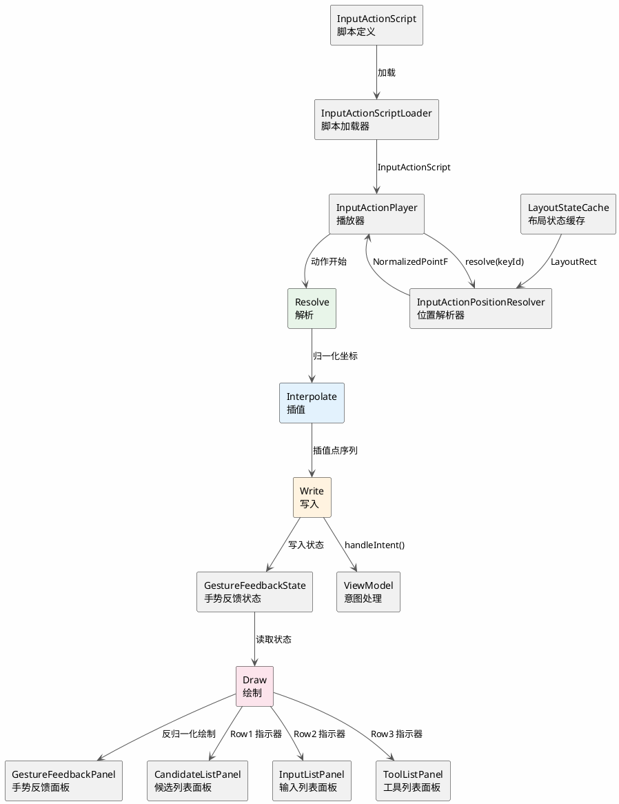

# 输入动作播放

`:ime-ui` 模块的输入动作播放子系统负责按照预定义的脚本自动执行一系列输入动作，用于教学演示和辅助输入两种场景。该子系统通过 `InputActionPlayer` 驱动，经由位置解析器将逻辑动作映射到界面坐标，再通过归一化坐标流写入 `GestureFeedbackState`，最终由 `GestureFeedbackPanel` 渲染视觉反馈。本章详细描述播放器的使用模式、状态模型、动作分发逻辑及坐标处理管线。

---

## 1. UseMode 使用模式

`UseMode` 定义了 `InputActionPlayer` 的两种使用模式，决定了播放器是否向编辑器提交文本以及是否显示指示器。

```kotlin
enum class UseMode {
    Animation,
    DirectInput,
}
```

### Animation 模式

`Animation` 模式用于教学演示和引导场景。在此模式下，`InputActionPlayer` 播放输入动作脚本时不会向编辑器提交任何文本内容，所有按键事件仅驱动视觉反馈（手指指示器移动、按键高亮、触摸轨迹绘制）。`showIndicator` 属性为 `true`，播放器会在 `CandidateListPanel`、`InputListPanel`、`ToolListPanel` 中渲染行指示器，标识当前操作的目标行。该模式适用于新用户引导、输入法功能教学、手势操作演示等场景，用户可以观看播放动画理解操作流程而不会干扰当前输入内容。

### DirectInput 模式

`DirectInput` 模式用于输入辅助场景。在此模式下，`InputActionPlayer` 播放输入动作脚本时会通过 `ViewModel.handleIntent()` 向编辑器提交实际文本，效果与用户手动输入完全一致。`showIndicator` 属性为 `false`，播放器不在任何面板中渲染行指示器，界面保持与正常输入时一致的外观。该模式适用于快捷短语输入、常用表达快速插入、连续符号输入等辅助场景，用户通过触发预设脚本即可快速完成复杂输入操作而无需逐键操作。

---

## 2. InputActionPlayerState 播放状态

`InputActionPlayerState` 是 `InputActionPlayer` 的状态模型，使用密封类（`sealed class`）定义五种互斥状态，完整描述播放器的生命周期。

```kotlin
sealed class InputActionPlayerState {
    data object Idle : InputActionPlayerState()

    data class Ready(
        val script: InputActionScript,
        val useMode: UseMode,
    ) : InputActionPlayerState()

    data class Playing(
        val script: InputActionScript,
        val useMode: UseMode,
        val currentActionIndex: Int,
        val progress: Float,
    ) : InputActionPlayerState()

    data class Paused(
        val script: InputActionScript,
        val useMode: UseMode,
        val currentActionIndex: Int,
        val progress: Float,
    ) : InputActionPlayerState()

    data class Finished(
        val script: InputActionScript,
        val useMode: UseMode,
    ) : InputActionPlayerState()
}
```

### 状态说明

- **`Idle`** — 播放器空闲状态，未加载任何脚本。此状态下播放器不占用任何资源，所有视觉反馈关闭。初始状态和脚本播放完成并重置后的状态。
- **`Ready`** — 脚本已加载，等待播放指令。`script` 包含待播放的动作序列，`useMode` 确定播放行为。此状态下可以调用 `play()` 开始播放，也可以调用 `unload()` 卸载脚本回到 `Idle`。
- **`Playing`** — 正在播放脚本。`currentActionIndex` 标识当前执行到第几个动作，`progress` 范围 `[0f, 1f]` 表示当前动作内的执行进度。此状态下可以调用 `pause()` 暂停或 `stop()` 停止。
- **`Paused`** — 播放已暂停。保留了当前进度信息，可以调用 `resume()` 继续播放或 `stop()` 停止。暂停时手指指示器保持当前位置不动。
- **`Finished`** — 脚本已播放完成。此状态下可以调用 `replay()` 重新播放同一脚本，或调用 `unload()` 卸载脚本回到 `Idle`。`Finished` 状态下所有视觉反馈关闭。

---

## 3. InputActionPlayer 播放器

`InputActionPlayer` 是输入动作播放的核心控制器，负责加载脚本、驱动播放、解析位置、写入反馈状态和发射 `ImeIntent`。

```kotlin
class InputActionPlayer(
    private val positionResolver: InputActionPositionResolver,
    private val feedbackState: GestureFeedbackState,
    private val intentHandler: (ImeIntent) -> Unit,
    private val coroutineScope: CoroutineScope,
) {
    val state: StateFlow<InputActionPlayerState>

    fun load(script: InputActionScript, useMode: UseMode)
    fun unload()
    fun play()
    fun pause()
    fun resume()
    fun stop()
    fun replay()

    private suspend fun executeAction(action: InputAction)
    private suspend fun executeKeyDown(action: KeyDown)
    private suspend fun executeSwipeTo(action: SwipeTo)
    private suspend fun executeKeyUp(action: KeyUp)
    private suspend fun executeSelectCandidate(action: SelectCandidate)
    private suspend fun executeSwitchKeyboard(action: SwitchKeyboard)
}
```

### 动作分发逻辑

`InputActionPlayer` 根据 `InputAction` 的类型分发至对应的执行方法：

#### KeyDown

1. 调用 `positionResolver.resolve(action.keyId)` 获取按键在当前布局中的归一化坐标。
2. 调用 `feedbackState.setFingerIndicator(pressed = true, position = resolvedPosition)` 设置手指指示器为按下状态。
3. 调用 `feedbackState.setPressedKeys(setOf(action.keyId))` 设置当前按下的按键集合。
4. 调用 `intentHandler(PressKey(keyId = action.keyId))` 发射按键按下意图。

#### SwipeTo

1. 调用 `positionResolver.resolve(action.fromKeyId)` 获取起始按键归一化坐标。
2. 调用 `positionResolver.resolve(action.toKeyId)` 获取目标按键归一化坐标。
3. 对起始和目标坐标之间进行路径插值，生成一系列中间点。插值算法使用贝塞尔曲线，控制点偏移量由 `action.curveBias` 决定，默认为轻微上凸。
4. 调用 `feedbackState.setTouchTrailPoints(interpolatedPoints)` 写入触摸轨迹点序列。
5. 使用 `animate` 函数沿插值路径移动手指指示器，动画时长由 `action.durationMs` 控制。每一帧更新 `feedbackState.setFingerIndicator(position = currentPosition)`。
6. 动画完成后调用 `intentHandler(PressKey(keyId = action.toKeyId))` 发射目标按键按下意图。

#### KeyUp

1. 调用 `feedbackState.setFingerIndicator(pressed = false)` 设置手指指示器为抬起状态。
2. 调用 `feedbackState.clearPressedKeys()` 清空按下的按键集合。

#### SelectCandidate

1. 调用 `positionResolver.resolveCandidatePosition(action.candidateIndex)` 获取候选词在候选列表中的归一化坐标。
2. 调用 `feedbackState.updateRow1Indicator(position = candidatePosition)` 更新第一行指示器位置。
3. 调用 `intentHandler(SelectCandidate(candidateIndex = action.candidateIndex))` 发射选择候选词意图。

#### SwitchKeyboard

1. 调用 `intentHandler(SwitchKeyboard(targetMode = action.targetMode))` 发射切换键盘意图。该动作不涉及视觉反馈状态的变更，键盘切换由 `ViewModel` 处理后触发界面重组。

---

## 4. ComposeInputActionPositionResolver

`ComposeInputActionPositionResolver` 是 `InputActionPositionResolver` 接口的 Compose 实现，通过读取布局状态缓存将按键标识和候选词索引映射为归一化坐标。

```kotlin
class ComposeInputActionPositionResolver(
    private val layoutStateCache: LayoutStateCache,
) : InputActionPositionResolver {

    override suspend fun resolve(keyId: KeyId): NormalizedPointF

    override suspend fun resolveCandidatePosition(candidateIndex: Int): NormalizedPointF

    override suspend fun resolveToolPosition(toolIndex: Int): NormalizedPointF
}
```

### 布局状态缓存

`layoutStateCache` 是 `LayoutStateCache` 的实例，由 `KeyLayoutPanel` 在每次布局测量后更新。缓存结构为 `Map<KeyId, LayoutRect>`，其中 `LayoutRect` 包含按键在面板内的相对位置和尺寸（均已归一化至 `[0f, 1f]` 范围）。缓存的更新通过 `SnapshotStateMap` 实现，确保在 Compose 重组线程和播放器协程之间安全共享。

### 按键位置解析

`resolve(keyId)` 方法从 `layoutStateCache` 中查找 `keyId` 对应的 `LayoutRect`，返回其中心点坐标。若 `keyId` 不存在于缓存中，方法抛出 `PositionUnresolvedException`，由 `InputActionPlayer` 捕获并记录日志后跳过该动作。

### 候选词位置解析

`resolveCandidatePosition(candidateIndex)` 方法读取候选列表的布局缓存，计算指定索引处候选词的中心点归一化坐标。由于候选列表使用 `LazyRow` 渲染，可能存在未组合的离屏项。`ComposeInputActionPositionResolver` 在解析前通过 `layoutStateCache.ensureCandidateVisible(candidateIndex)` 触发 `LazyRow` 滚动至目标位置，确保该项已被测量和缓存。

### 工具位置解析

`resolveToolPosition(toolIndex)` 方法与候选词位置解析逻辑类似，读取工具列表的布局缓存并返回工具项的中心点归一化坐标。同样支持离屏工具项的预滚动机制。

---

## 5. InputActionScriptLoader 脚本加载器

`InputActionScriptLoader` 负责从预设和文件两种来源加载 `InputActionScript`，提供给 `InputActionPlayer` 使用。

```kotlin
class InputActionScriptLoader(
    private val context: Context,
    private val json: Json,
) {
    fun loadPreset(presetId: PresetId): InputActionScript
    fun loadFile(uri: Uri): InputActionScript
}
```

### 预设加载

`loadPreset(presetId)` 方法从应用资源中加载预定义的脚本。预设脚本以 JSON 格式存储在 `assets/scripts/` 目录下，文件名与 `presetId` 对应。JSON 结构如下：

```json
{
  "id": "preset_greeting",
  "name": "问候语",
  "description": "快速输入常用问候语",
  "useMode": "DirectInput",
  "actions": [
    { "type": "KeyDown", "keyId": "key_n" },
    { "type": "KeyUp" },
    { "type": "KeyDown", "keyId": "key_i" },
    { "type": "KeyUp" },
    { "type": "KeyDown", "keyId": "key_hao" },
    { "type": "KeyUp" },
    { "type": "SelectCandidate", "candidateIndex": 0 }
  ]
}
```

`Json` 实例配置为宽松模式（`ignoreUnknownKeys = true`），确保脚本格式向前兼容。预设加载是同步操作，因为资源文件体积小且读取速度快。

### 文件加载

`loadFile(uri)` 方法从用户指定的文件 URI 加载脚本。支持 `content://` 和 `file://` 两种 URI 方案。文件加载是挂起函数，在 IO 调度器上执行。加载流程包括：读取文件内容、解析 JSON、校验脚本格式（必须包含 `id`、`actions` 字段，每个 `action` 必须包含合法的 `type`）、构建 `InputActionScript` 实例。校验失败时抛出 `ScriptFormatException` 并附带详细的错误描述信息。

---

## 6. 指示器内建机制

`InputActionPlayer` 的指示器内建机制定义了三行指示器的渲染逻辑，分别对应 `CandidateListPanel`、`InputListPanel` 和 `ToolListPanel` 的行级位置标识。

### 行定义

```kotlin
enum class IndicatorRow {
    ROW_1,  // 对应 CandidateListPanel
    ROW_2,  // 对应 InputListPanel
    ROW_3,  // 对应 ToolListPanel
}
```

### 渲染方法

指示器的渲染由各面板内建的覆盖层实现，`InputActionPlayer` 仅负责写入指示器状态：

```kotlin
data class PlayerIndicatorState(
    val active: Boolean,
    val row: IndicatorRow,
    val normalizedPosition: NormalizedPointF?,
)

class GestureFeedbackState {
    fun updateRow1Indicator(position: NormalizedPointF)
    fun updateRow2Indicator(position: NormalizedPointF)
    fun updateRow3Indicator(position: NormalizedPointF)
    fun clearAllIndicators()
}
```

### Row 1 指示器

第一行指示器渲染于 `CandidateListPanel` 中。当 `InputActionPlayer` 执行 `SelectCandidate` 动作时，调用 `feedbackState.updateRow1Indicator(position)` 更新指示器位置。`CandidateListPanel` 读取 `PlayerIndicatorState`，当 `active` 为 `true` 且 `row` 为 `ROW_1` 时，在指定位置绘制一条水平高亮线，宽度与候选词项对齐，颜色为 `KeyboardColors.playerIndicatorColor`，带有淡入动画。

### Row 2 指示器

第二行指示器渲染于 `InputListPanel` 中。当 `InputActionPlayer` 执行 `KeyDown` 动作且目标为字符键时，调用 `feedbackState.updateRow2Indicator(position)` 更新指示器位置。`InputListPanel` 读取 `PlayerIndicatorState`，当 `active` 为 `true` 且 `row` 为 `ROW_2` 时，在指定位置绘制一个竖向高亮条，标识当前正在输入的字符位置。

### Row 3 指示器

第三行指示器渲染于 `ToolListPanel` 中。当 `InputActionPlayer` 执行涉及工具栏操作的动作时，调用 `feedbackState.updateRow3Indicator(position)` 更新指示器位置。`ToolListPanel` 读取 `PlayerIndicatorState`，当 `active` 为 `true` 且 `row` 为 `ROW_3` 时，在指定位置绘制一条水平高亮线，视觉规格与 Row 1 指示器保持一致。

### 指示器与 UseMode 的关系

指示器的显示由 `UseMode` 决定：`Animation` 模式下 `showIndicator` 为 `true`，所有面板中对应行的指示器正常渲染；`DirectInput` 模式下 `showIndicator` 为 `false`，`InputActionPlayer` 不写入任何指示器状态，各面板的指示器覆盖层始终处于隐藏状态。这一机制确保了教学演示场景下的视觉引导和辅助输入场景下的界面简洁性。

---

## 7. 归一化坐标流

归一化坐标流描述了从动作解析到视觉渲染的完整数据管线，遵循 `Resolve → Interpolate → Write → Draw` 四阶段流水线。

### Resolve 阶段

`InputActionPlayer` 在执行每个动作时，首先调用 `positionResolver.resolve()` 或其变体方法，将逻辑标识（`KeyId`、`candidateIndex`、`toolIndex`）解析为归一化坐标点。解析器读取 `LayoutStateCache` 中缓存的布局测量结果，计算目标元素的中心点并归一化至 `[0f, 1f]` 范围。归一化坐标与屏幕分辨率无关，确保在不同设备上的一致性。

### Interpolate 阶段

对于需要路径动画的动作（如 `SwipeTo`），`InputActionPlayer` 在起始点和目标点之间进行路径插值。插值算法生成一组有序的归一化坐标点序列，点间距由动画时长和帧率决定（默认 60fps）。插值使用二次贝塞尔曲线，控制点沿法线方向偏移，偏移量由 `action.curveBias` 参数控制。对于 `KeyDown` 和 `KeyUp` 等点动作，不进行插值，直接使用解析后的单点坐标。

### Write 阶段

`InputActionPlayer` 将解析和插值的结果写入 `GestureFeedbackState`。写入操作包括：`setFingerIndicator()` 设置手指指示器位置和状态、`setPressedKeys()` 设置当前按下的按键集合、`setTouchTrailPoints()` 写入触摸轨迹点序列、`updateRowXIndicator()` 更新行指示器位置。所有写入操作通过 `SnapshotStateMap` 和 `MutableState` 实现，确保在播放器协程和 Compose 渲染线程之间的状态同步。

### Draw 阶段

`GestureFeedbackPanel` 作为数据管的终端，读取 `GestureFeedbackState` 中的归一化坐标，通过反归一化转换为像素坐标后在 `Canvas` 上绘制。反归一化公式为 `pixelX = normalizedX * panelWidth`、`pixelY = normalizedY * panelHeight`。绘制内容包括：手指指示器圆形、按键高亮矩形、触摸轨迹贝塞尔曲线。同时，各面板（`CandidateListPanel`、`InputListPanel`、`ToolListPanel`）读取 `PlayerIndicatorState`，绘制行级指示器。整个管线的帧率由 Compose 的重组机制保证，默认与屏幕刷新率同步。

---


